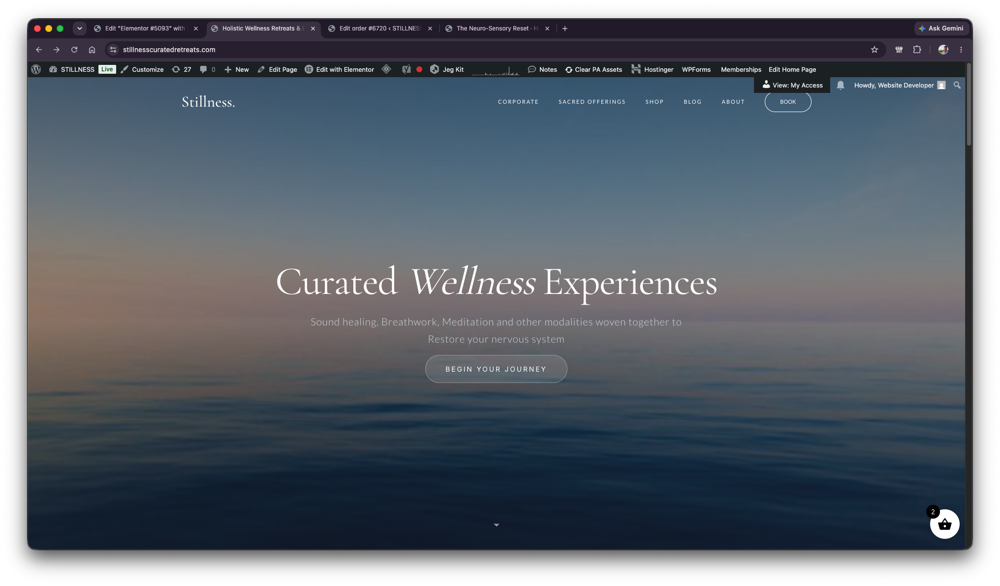
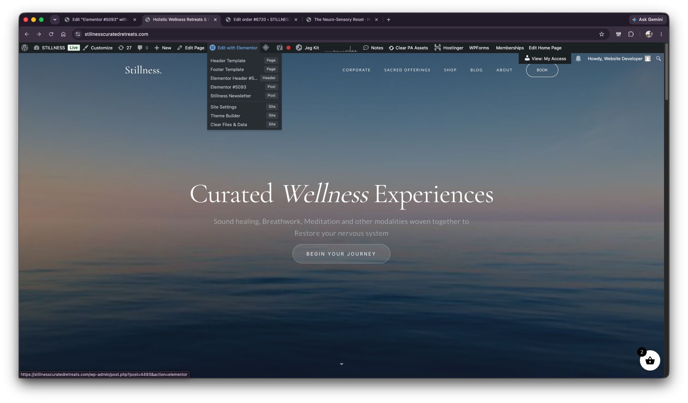
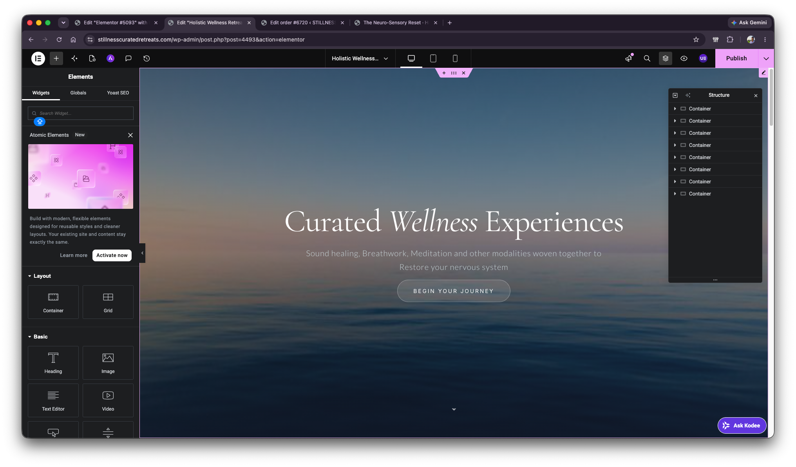
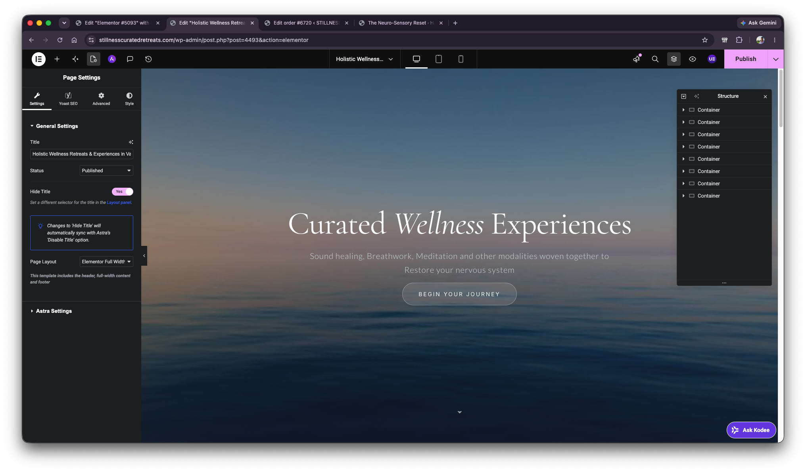
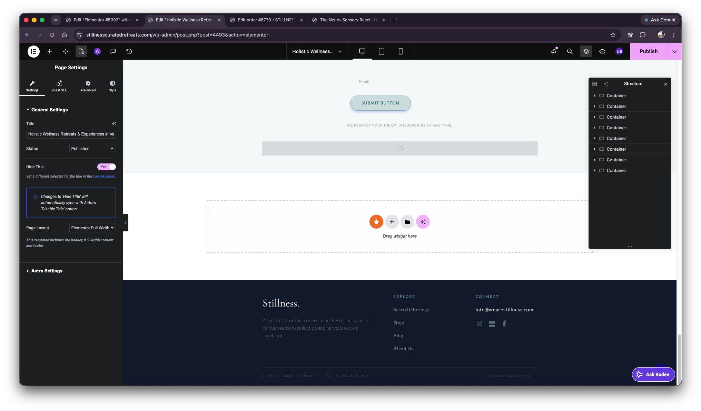

# Header Issue Context - Homepage Elementor State

## Scope

This file records the first part of the context provided on 2026-06-15.

No diagnosis or solution is included here. This is only an evidence capture.

## User Notes

- This is the homepage of the website.
- On hover over **Edit with Elementor**, multiple edit targets are visible.
- After clicking **Edit with Elementor**, Elementor opens the homepage editor.
- The homepage **Page Layout** is set to **Elementor Full Width**.
- The footer is visible inside the homepage Elementor editor.
- The user noted that this is only one part of the context and more context will follow.

## Website / Admin Context Visible

- Site: `stillnesscuratedretreats.com`
- WordPress admin bar is visible.
- Page appears to be the Stillness homepage.
- Main hero text visible on homepage:
  - `Curated Wellness Experiences`
  - `Sound healing, Breathwork, Meditation and other modalities woven together to`
  - `Restore your nervous system`
  - Button: `BEGIN YOUR JOURNEY`

## Edit With Elementor Menu Options Visible

The hover menu under **Edit with Elementor** shows these targets:

- `Header Template`
- `Footer Template`
- `Elementor Header #5...`
- `Elementor #5093`
- `Stillness Newsletter`
- `Site Settings`
- `Theme Builder`
- `Clear Files & Data`

## Elementor Editor State

- URL visible in screenshots:
  - `stillnesscuratedretreats.com/wp-admin/post.php?post=4493&action=elementor`
- Elementor editor opens with the homepage content visible.
- Elementor navigator/structure panel shows multiple containers.
- Page Settings panel shows:
  - Title begins with `Holistic Wellness Retreats & Experiences in Va...`
  - Status: `Published`
  - Hide Title: `Yes`
  - Page Layout: `Elementor Full Width`
- Elementor note under Page Layout says:
  - `This template includes the header, full-width content and footer`

## Footer Visibility

The footer is visible while editing the homepage in Elementor.

Visible footer content includes:

- Brand text: `Stillness.`
- Footer description:
  - `A sanctuary for the modern mind. Restoring balance through sensory reduction and nervous system regulation.`
- Explore links:
  - `Sacred Offerings`
  - `Shop`
  - `Blog`
  - `About Us`
- Connect email:
  - `info@wearestillness.com`
- Copyright:
  - `© 2026 STILLNESS WELLNESS CO. ALL RIGHTS RESERVED.`
- Credit:
  - `DEVELOPED BY SOLICATE.`

## Screenshots

1. Homepage with WordPress admin bar:

   

2. Edit with Elementor hover menu:

   

3. Elementor homepage editor, hero section:

   

4. Elementor Page Settings showing Page Layout:

   

5. Elementor editor showing footer visible on homepage:

   
