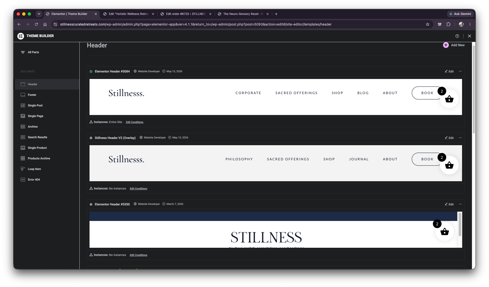
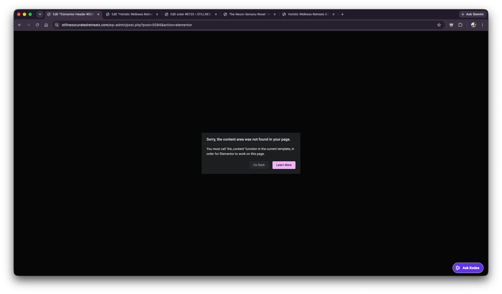
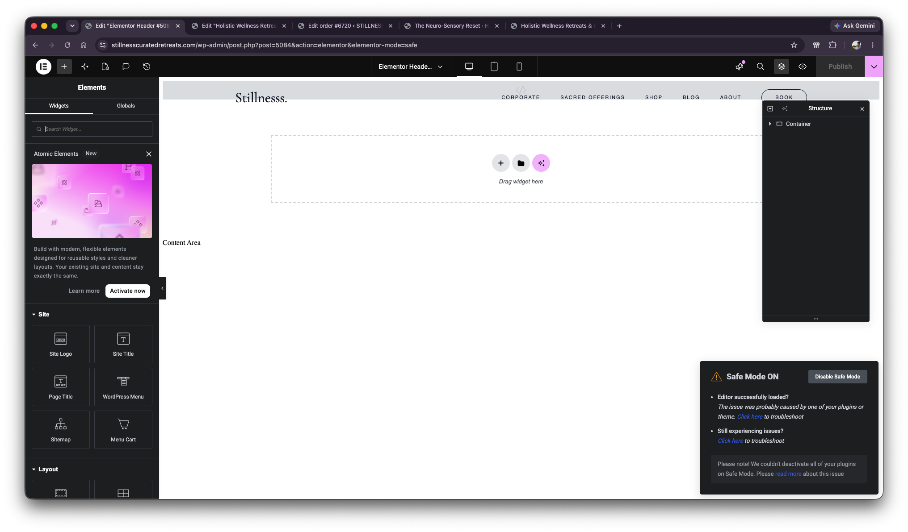
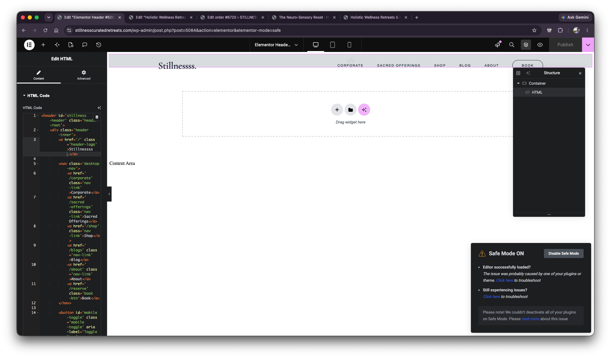

# Header Issue Context - Theme Builder Header Edit Attempt

## Scope

This file records the second part of the context provided on 2026-06-15.

No diagnosis or solution is included here. The questions at the end are recorded as open questions only.

## User Notes

- In Elementor Theme Builder, under the **Header** page, there is a header component.
- The header component appears to look exactly like the header seen on the live website.
- The header component has a green dot.
- When clicking the **Edit** option for that header, Elementor shows an error screen.
- After enabling Safe Mode, the editor loads.
- The user updated something inside the HTML code box:
  - changed `Stillness.` to `Stillnesss.`
- The user clicked **Publish** after editing.
- The change did not reflect on the main/live page.
- The user noted that this is only one part of the context and more context will follow.

## Theme Builder Header List

Visible location:

- Elementor Theme Builder
- Site Parts: `Header`

Visible URL:

- `stillnesscuratedretreats.com/wp-admin/admin.php?page=elementor-app&ver=4.1.1&return_to=/wp-admin/post.php?post=5093&action=edit#/site-editor/templates/header`

Visible header templates:

- `Elementor Header #5084`
  - Has a green dot.
  - Preview shows the header layout with:
    - Logo text: `Stillnesss.`
    - Menu items: `CORPORATE`, `SACRED OFFERINGS`, `SHOP`, `BLOG`, `ABOUT`, `BOOK`
  - Instance condition shown:
    - `Instances: Entire Site`
- `Stillness Header V2 (Overlay)`
  - Preview also shows a similar header.
  - Instance condition shown:
    - `Instances: No instances`
- `Elementor Header #5350`
  - Preview appears visually different.
  - Instance condition shown:
    - `Instances: No instances`

## Edit Attempt For Header 5084

When editing `Elementor Header #5084`, Elementor shows this error:

- `Sorry, the content area was not found in your page.`
- `You must call 'the_content' function in the current template, in order for Elementor to work on this page.`

Visible URL:

- `stillnesscuratedretreats.com/wp-admin/post.php?post=5084&action=elementor`

## Safe Mode State

After enabling Safe Mode, Elementor editor loads for the header.

Visible URL:

- `stillnesscuratedretreats.com/wp-admin/post.php?post=5084&action=elementor&elementor-mode=safe`

Visible Safe Mode panel text:

- `Safe Mode ON`
- `Editor successfully loaded?`
- `The issue was probably caused by one of your plugins or theme. Click here to troubleshoot`
- `Still experiencing issues? Click here to troubleshoot`
- `Please note! We couldn't deactivate all of your plugins on Safe Mode. Please read more about this issue`

The canvas shows:

- Header layout visible at the top.
- A large empty section with `Drag widget here`.
- Text visible on page: `Content Area`
- Structure panel shows:
  - `Container`

## HTML Widget / Header Code Edit

Inside Safe Mode, an HTML widget is visible in the structure panel:

- Structure panel:
  - `Container`
  - `HTML`

The left panel shows **Edit HTML** with an HTML Code box.

Visible HTML snippet includes:

```html
<header id='stillness-header' class='head...-root'>
  <div class='header-inner'>
    <a href='/' class='header-logo'>Stillnesss.</a>
    <nav class='desktop-nav'>
      <a href='/corporate' class='nav-link'>Corporate</a>
      <a href='/sacred-offerings' class='nav-link'>Sacred Offerings</a>
      <a href='/shop' class='nav-link'>Shop</a>
      <a href='/blog' class='nav-link'>Blog</a>
      <a href='/about' class='nav-link'>About</a>
      <a href='/reserve' class='book-btn'>Book</a>
    </nav>
```

The canvas preview shows the header logo text as:

- `Stillnesss.`

## Open Questions To Investigate Later

- Did the edited changes fail to reflect on the live page because the header was edited/published while Elementor was in Safe Mode?
- Or is `Elementor Header #5084` not the actual header responsible for the header shown across the live website?

## Screenshots

1. Elementor Theme Builder Header list showing template 5084, green dot, and Entire Site condition:

   

2. Editing Header 5084 shows Elementor content area not found error:

   

3. Header 5084 loaded in Elementor Safe Mode:

   

4. Header 5084 HTML widget with edited logo text in Safe Mode:

   
