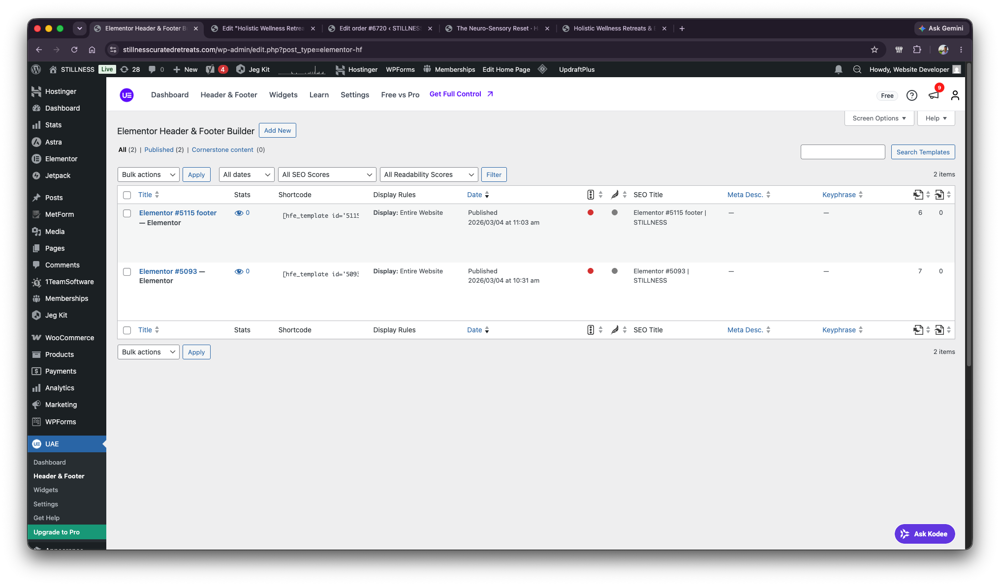
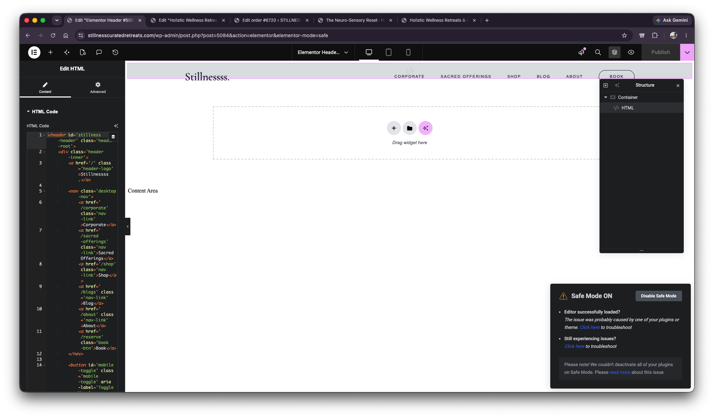

# Header Issue Context - UAE Header And Footer Builder Cross-Check

## Scope

This file records the third part of the context provided on 2026-06-15.

No diagnosis or solution is included here. This is only an evidence capture.

## User Notes

- In the UAE **Header & Footer** area, the template ID numbers are visible clearly.
- The header entry has ID `5093`.
- The user checked **Edit with Elementor** on this page as well.
- The user changed the visible logo text to `Stillnesssx.`
- One point to consider:
  - The text was changed from `Stillnesss.` to `Stillnesssx.`
  - This raised a question about whether the Theme Builder header corresponds to this same header.
- The user then cross-checked the Theme Builder header component that is live and has the green dot.
- Clicking **Edit** in Elementor Theme Builder for the header component showed the error again.
- After waiting, the **Enable Safe Mode** option appeared.
- After enabling Safe Mode, the Theme Builder header did not appear to show the `Stillnesssx.` change.
- The Theme Builder header still showed `Stillnessss.`
- The user noted that this is only one part of the context and more context will follow.

## UAE Header & Footer Builder List

Visible location:

- WordPress admin
- UAE menu
- `Header & Footer`
- Page title: `Elementor Header & Footer Builder`

Visible URL:

- `stillnesscuratedretreats.com/wp-admin/edit.php?post_type=elementor-hf`

Visible templates:

- `Elementor #5115 footer — Elementor`
  - Shortcode begins with:
    - `[hfe_template id='5115...`
  - Display Rules:
    - `Display: Entire Website`
  - Published:
    - `2026/03/04 at 11:03 am`
- `Elementor #5093 — Elementor`
  - Shortcode begins with:
    - `[hfe_template id='5093...`
  - Display Rules:
    - `Display: Entire Website`
  - Published:
    - `2026/03/04 at 10:31 am`

## Theme Builder Cross-Check

The user returned to the Theme Builder header component and opened it again.

Visible URL:

- `stillnesscuratedretreats.com/wp-admin/post.php?post=5084&action=elementor&elementor-mode=safe`

Visible state:

- Elementor Safe Mode is ON.
- The HTML widget is selected.
- Structure panel shows:
  - `Container`
  - `HTML`
- The canvas header logo text shows:
  - `Stillnessss.`
- The HTML code box shows the logo text as:
  - `Stillnessss`

## Recorded Difference

The user changed one header/page to:

- `Stillnesssx.`

But the Theme Builder header cross-check showed:

- `Stillnessss.`

This difference is recorded as context only.

## Screenshots

1. UAE Header & Footer Builder showing footer `5115` and header `5093`, both set to Entire Website:

   

2. Theme Builder header 5084 in Safe Mode still showing `Stillnessss.` without the added `x`:

   
