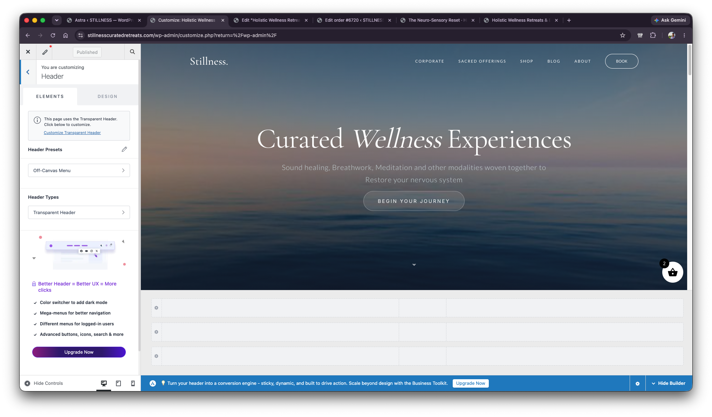

# Header Issue Context - Astra Customizer Header And Additional CSS

## Scope

This file records the fourth part of the context provided on 2026-06-15.

No diagnosis or solution is included here. This is only an evidence capture.

## User Notes

- This screenshot shows how the header looks in the Astra Customizer header page.
- The user also provided the Additional CSS used in Astra.
- The user noted that more context will follow.

## Astra Customizer Header View

Visible location:

- WordPress Customizer
- Astra
- Header

Visible URL:

- `stillnesscuratedretreats.com/wp-admin/customize.php?return=%2Fwp-admin%2F`

Visible Customizer state:

- The user is customizing: `Header`
- The left panel shows:
  - `Elements`
  - `Design`
  - Notice: `This page uses the Transparent Header. Click below to customize.`
  - Link: `Customize Transparent Header`
  - Header Presets: `Off-Canvas Menu`
  - Header Types: `Transparent Header`
- The preview shows the homepage hero with the visible header:
  - Logo text: `Stillness.`
  - Menu items: `CORPORATE`, `SACRED OFFERINGS`, `SHOP`, `BLOG`, `ABOUT`, `BOOK`

## Additional CSS Provided

```css
.ast-separate-container #primary, .ast-separate-container.ast-left-sidebar #primary, .ast-separate-container.ast-right-sidebar #primary {
    margin: 0 !important;
    padding: 0;
}
#colophon,
.ast-builder-footer-grid-columns,
.ast-footer-widget-area,
.ast-above-footer-wrap {
    display: none !important;
}
/* Hide ALL Astra footer rows */
#colophon,
.site-footer,
.ast-site-footer-wrap,
.ast-builder-footer-grid-columns,
.ast-footer-widget-area {
    display: none !important;
}
/* Fix header-content gap on specific product pages */
.single-product.light-page #content {
    padding-top: 0 !important;
}

/* 1. Remove Top Padding from Astra Main Container */
.single-product .site-content {
    padding-top: 0 !important;
}

/* 2. Remove Margin from Astra Primary Content Area */
.single-product #primary {
    margin-top: 0 !important;
    padding-top: 0 !important;
}

/* 3. specifically target the Astra Breadcrumb wrapper */
.ast-breadcrumbs-wrapper {
    margin-bottom: 0 !important;
    padding-bottom: 0 !important;
}

/* 4. Remove padding from the WooCommerce content wrapper */
.single-product .ast-woocommerce-container {
    padding-top: 0 !important;
}

/* 5. If using "Boxed" layout, remove top margin from the article */
.ast-separate-container.single-product .ast-article-single {
    margin-top: 0 !important;
}
```

## Screenshot

1. Astra Customizer Header page showing Transparent Header state and homepage header preview:

   
